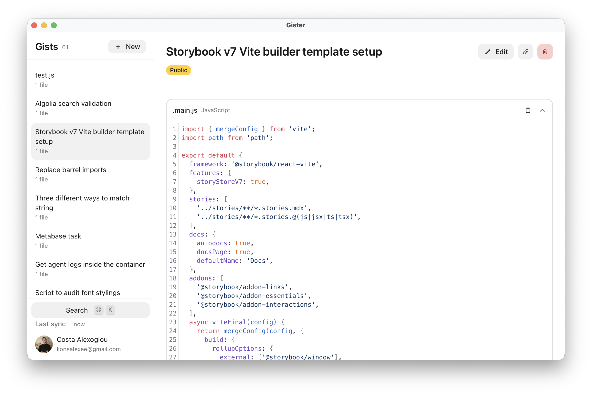
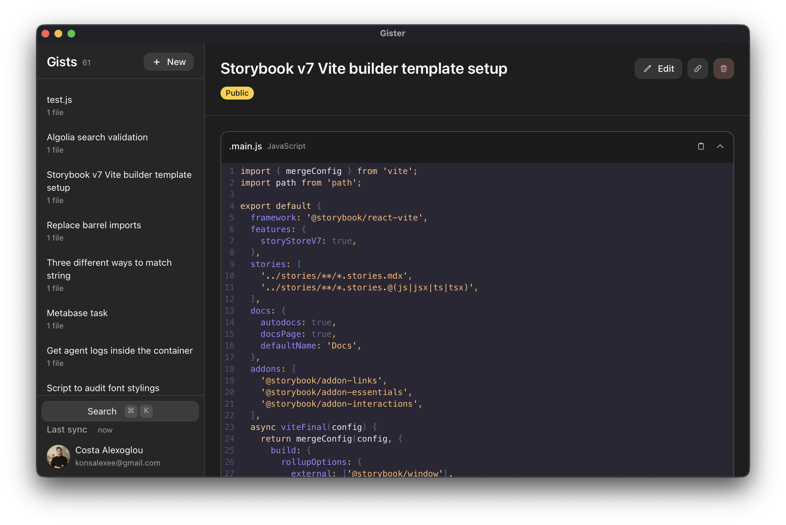

<p align="center">
    
</p>

[](https://github.com/gethopp/gister/blob/main/LICENSE.md)
[](https://gethopp.app)

<h2 align="center" style="margin-top:-20px">Gister</h2>

**Gister** is a local-fist, and super-fast code snippet manager powered by GitHub Gist. Aspiring to be the Linear for Gist management.

## Features

- Local first, making loading gists super fast
- Cross-platform (macOS, Linux, Windows)
- MCP server support for working with agents
- Light-weight (~11Mb) built on Tauri
- Support for GitHub enterprise
- Search snippets
- Free and OSS

|               Light Theme                |               Dark Theme               |
| :--------------------------------------: | :------------------------------------: |
|  |  |

## Install

There are multiple ways to install Gister.

For all operating systems (macOS, Windows, Linux) you can visit the releases page and [download the latest version](https://github.com/gethopp/gister/releases).

For macOS you can also use brew:

```
brew tap gethopp/tap
brew trust gethopp/tap
brew install --cask gethopp/tap/gister
```

## Tech stack

Gister is a [Tauri](https://tauri.app) desktop app, with [React](https://react.dev) and TypeScript frontend bundled with [Vite](https://vite.dev), plus a small [Rust](https://www.rust-lang.org) core that holds the MCP server.

Some extra noteworthy libraries:

- [Astryx](https://www.npmjs.com/package/@astryxdesign/core) for the component library and theming
- [Dexie](https://dexie.org) (IndexedDB) as the local-first source of truth
- [Zustand](https://github.com/pmndrs/zustand) for runtime state that mirrors the local DB
- [CodeMirror](https://codemirror.net) for editing and syntax highlighting and and `react-markdown` with `remark-gfm` for rendering markdown files
- [Fuse.js](https://www.fusejs.io) for fuzzy search
- [rmcp](https://github.com/modelcontextprotocol/rust-sdk), the official Rust MCP SDK, runs a full MCP server inside the app
- [axum](https://github.com/tokio-rs/axum) and [tokio](https://tokio.rs) serve it over streamable HTTP at `127.0.0.1:1996/mcp`, so your agents can list, search, read, create, and edit gists while Gister is open

## Roadmap

Feel free to tackle any points from the ones below if you are up for it!

- [ ] Add more keyboard shortcts for oprations like deleting a Gist etc.
- [ ] Support for Jupiter notebooks
- [ ] Support for GitLab
- [ ] Tag support for organizing gists

Or if you find any bug or have any feature requests, please feel free to open an issue or a pull request.

## Sponsor Gister

At Hopp, we are building high quality OSS tools to help developers build better software. Some of our projects include:

1. Hopp - The best OSS pair-programming app for developers (macOS and Windows)
2. [Figma-mcp-brigde](https://github.com/gethopp/figma-mcp-bridge) - Figma Plugin + MCP server that streams live Figma document data to AI tools without hitting Figma API rate limits
3. [Gister](https://github.com/gethopp/gister) - OSS code snippet manager for developers

If you want to sponsor Gister and our work please check our GitHub Sponsors page: https://github.com/sponsors/gethopp ❤️

## Why I built Gister

I used to be a heavy [Lepton](http://github.com/hackjutsu/Lepton) user. At some point I figured the project was dead, so I started building my own replacement (turns out the maintainer came back and shipped v2 in the meantime, congrats on that!).

What I really wanted was a code snippet manager that feels like Linear: local-first, keyboard-first, and fast enough that it never gets in the way. That's Gister.
